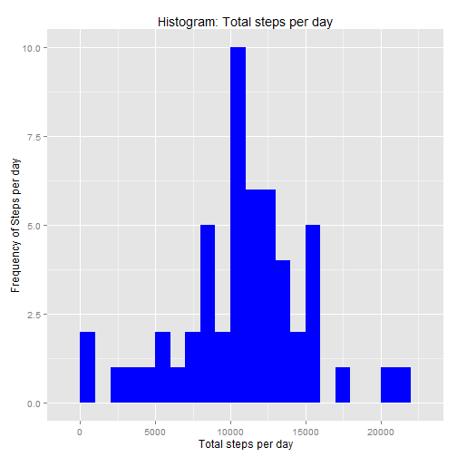
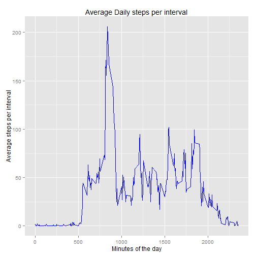
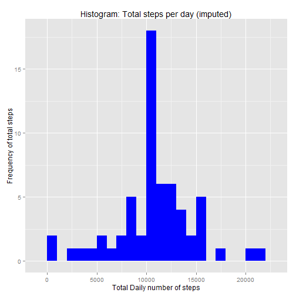
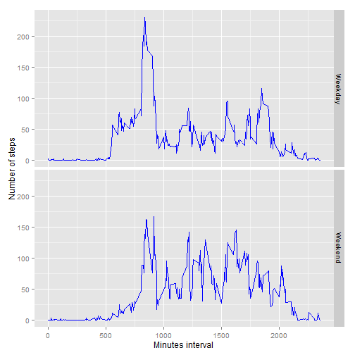

##Load libraries

```r
require(ggplot2)
```

```
## Loading required package: ggplot2
```

```
## Warning: package 'ggplot2' was built under R version 3.1.3
```

```r
require(dplyr)
```

```
## Loading required package: dplyr
```

```
## Warning in library(package, lib.loc = lib.loc, character.only = TRUE,
## logical.return = TRUE, : there is no package called 'dplyr'
```

## Loading and preprocessing the data
Download and unzip file

```r
tmp<-tempfile()
url<- "https://d396qusza40orc.cloudfront.net/repdata%2Fdata%2Factivity.zip"
download.file(url,tmp)
```

```
## Error in download.file(url, tmp): unsupported URL scheme
```

```r
unzip(tmp)
```

```
## Warning in unzip(tmp): error 1 in extracting from zip file
```

```r
unlink(tmp)
```

Read activity.csv file

```r
activity.file<-read.csv("activity.csv",colClasses=c("numeric","character","numeric"))
dim(activity.file)
```

```
## [1] 17568     3
```

Convert Date to Date class

```r
activity.file$date<-as.Date(activity.file$date,format="%Y-%m-%d")
```

## What is mean total number of steps taken per day?
Calculate total steps for each day and plot a histogram

```r
total_steps<- aggregate(steps~date,activity.file,sum)
ggplot(total_steps,aes(x=steps)) +
    geom_histogram(fill="blue",binwidth=1000) +
      labs(title="Histogram: Total steps per day", x="Total steps per day",y="Frequency of Steps per day") 
```

 

Calculate mean and median

```r
summary(total_steps)
```

```
##       date                steps      
##  Min.   :2012-10-02   Min.   :   41  
##  1st Qu.:2012-10-16   1st Qu.: 8841  
##  Median :2012-10-29   Median :10765  
##  Mean   :2012-10-30   Mean   :10766  
##  3rd Qu.:2012-11-16   3rd Qu.:13294  
##  Max.   :2012-11-29   Max.   :21194
```

```r
mean_steps<- mean(total_steps$steps, na.rm= TRUE)
print(mean_steps)
```

```
## [1] 10766.19
```

```r
median_steps<- median(total_steps$steps, na.rm=TRUE)
print(median_steps)
```

```
## [1] 10765
```


## What is the average daily activity pattern?
Calculate average steps per interval and plot the same

```r
activity.pattern<-aggregate(x=list(steps=activity.file$steps),by=list(interval=activity.file$interval),FUN=mean,na.rm=TRUE)
ggplot(activity.pattern,aes(x=interval,steps))+geom_line(col="blue")+
  labs(title="Average Daily steps per interval",x="Minutes of the day",y="Average steps per interval")
```

 

Which 5 minute interval has the highest mean number of steps?

```r
activity.pattern[which.max(activity.pattern$steps),'interval']
```

```
## [1] 835
```

## Imputing missing values
Look at total number of NA values

```r
na.values<-length(which(is.na(activity.file)))
print(na.values)
```

```
## [1] 2304
```

Create a dataset to fill in missing values with mean of the column

```r
imp.steps<- function(rows.na,act.file,act_pattern){
 steps.imputed<-unlist(lapply(rows.na,FUN=function(i){
    int= act.file[i,]$interval
    act_pattern[act_pattern$interval==int,]$steps}))
 act.file[rows.na,]$steps<-steps.imputed
 act.file 
 }

activity.imp <- activity.file
rows.na<-which(is.na(activity.imp$steps))
activity.imp<-imp.steps(rows.na,activity.file,activity.pattern)
  
activity.imp.total_steps <- aggregate(steps ~ date, activity.imp, sum)

#Plot histogram
ggplot(activity.imp.total_steps,aes(x=steps))+
  geom_histogram(fill="blue",binwidth=1000) +
  labs(title="Histogram: Total steps per day (imputed)",
       x="Total Daily number of steps",
       y="Frequency of total steps")
```

 
Mean and Median comparison with 

```r
mean(activity.imp.total_steps$steps)
```

```
## [1] 10766.19
```

```r
mean(total_steps$steps)
```

```
## [1] 10766.19
```

```r
median(activity.imp.total_steps$steps)
```

```
## [1] 10766.19
```

```r
median(total_steps$steps)
```

```
## [1] 10765
```

We see that the imputed dataset has the same mean but the median is slightly increased

## Are there differences in activity patterns between weekdays and weekends?

```r
activity.imp$day<- ifelse(weekdays(activity.imp$date) %in% c("Sunday","Saturday"),"Weekend","Weekday")
activity.weekday<-aggregate(steps ~ interval + day, activity.imp,mean)

ggplot(activity.weekday, aes(interval, steps)) + geom_line(col="blue") + facet_grid(day ~ .) +
    xlab("Minutes interval") + ylab("Number of steps")
```

 

Comparing Weekdays and Weekend data, there seems that weekends do not have the 835 spike in the number of steps.
Probably because people are not trying to hurry to work :)
